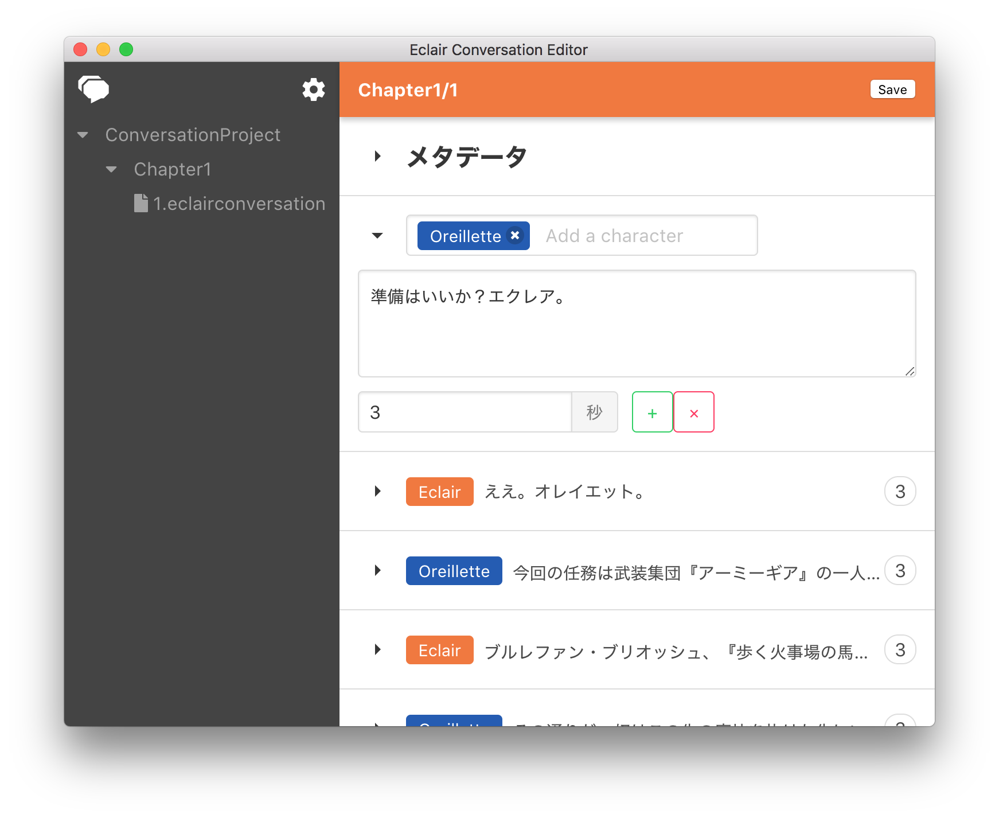

# Eclair Conversation Editor

> Editor for ue4 eclair conversation plugin



## 初期設定

### Project Folder
EclairConversationファイルを管理するフォルダを指定してください。  

末尾には`/`をつけてください。

UE4プロジェクトに`ConversationProject`などといった名前のフォルダを作成しそこを指定すると良いでしょう。

## 使い方
編集して保存するだけです。
`Ctrl+Shift+E`で全部折りたためます。

ファイル操作周りは実装めんどいからファインダーからよろしく(左ペイン右クリックで`Reveal in Finder`が出るよ)

## Build Setup

``` bash
# install dependencies
npm install

# serve with hot reload at localhost:9080
npm run dev

# build electron application for production
npm run build


```

---

This project was generated with [electron-vue](https://github.com/SimulatedGREG/electron-vue)@[cf53551](https://github.com/SimulatedGREG/electron-vue/tree/cf53551a209b49220525e7de80f1c541d7096aef) using [vue-cli](https://github.com/vuejs/vue-cli). Documentation about the original structure can be found [here](https://simulatedgreg.gitbooks.io/electron-vue/content/index.html).
